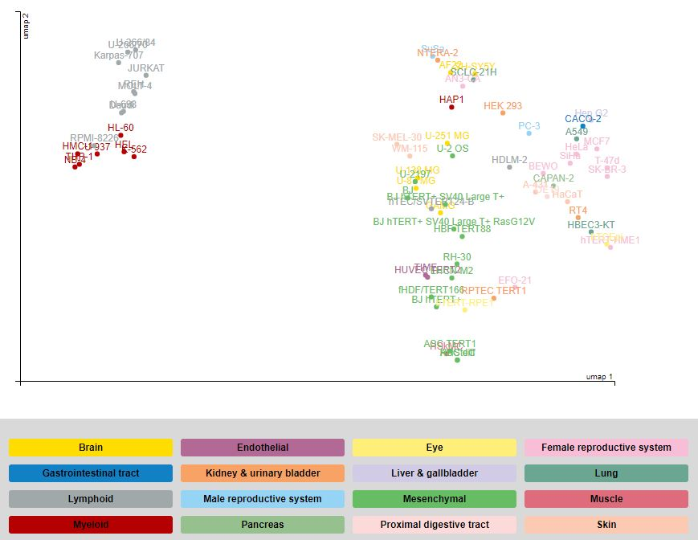

Description of analysis
=======================
Version 1.0 (18-Apr-2022) Rachel Lau (Github [RLau0](https://github.com/RLau0))

This is the R notebook for generating cell atlas plots for any given gene(s) of interest, highlighting cell lines that are normal or cancer derived. 

Cell atlas is from the human protein atlas containing RNA-seq data from 69 cell lines. The [data](https://www.proteinatlas.org/about/download) is publicly available under the section 'RNA HPA cell line gene data'. More information about this database is found [here](https://www.proteinatlas.org/humanproteome/cell+line) and the list of cell lines is found [here](https://www.proteinatlas.org/learn/cellines).

As you can see from the plot below, there is a range of cell lines from different tissue types. 


Note that as per the plots you can get from cell atlas, the NX (normalised) values will be used for RNA expression. However, TPM could be plotted potentially. In this instance, NX needs to be replaced with TPM upon column selection. This code replacement for plotting TPM would be indicated in the code below if this customisation needs to be applied. 

Uploading data
==============

First we upload the raw RNA data of cell atlas.

```{r}
Cell_atlas<-read.delim("rna_celline.tsv")
```

Next, we upload the cell line information

```{r}
Cell_line<-read.delim("Cell_line_atlas.txt")
Cell_line$Tissue<-as.factor(Cell_line$Tissue)
rownames(Cell_line)<-Cell_line$Name
Cell_line$Cancer.or.normal<-as.factor(Cell_line$Cancer.or.normal)
```

Searching multiple genes
=========================

In the code below and within the brackets after filter <- c (), type the genes you want to search for and plot where each gene is surrounded by " ". 
E.g filter<-c("ACTA2", "FAP")

RNA expression datatable
------------------------

```{r, warning=FALSE, message=FALSE}
filter<-c("ACTA2","FAP")

Protein_sub<-Cell_atlas[which(Cell_atlas$Gene.name%in%filter), ]

library(DT)
DT::datatable(Protein_sub, 
              extensions='Buttons', options = list(
                dom = 'Blfrtip',
                buttons = 'copy',
                lengthMenu = list(c(10,25,50, 75, 100, -1), 
                                          c('10', '25', '50','75','100', 'All')),paging = T
                ))
```

Plots
----

```{r, warning=FALSE, message=FALSE, fig.width=10, fig.height=5}
library(tidyverse)
Protein_sub2<-Protein_sub%>%
  select(Gene.name, Cell.line, NX)%>%
  pivot_wider(names_from=Gene.name, values_from=NX)

Protein_sub3<-merge(Protein_sub2, Cell_line, by.x="Cell.line", by.y="Name")

Protein_sub4<-as.data.frame(Protein_sub3[, -1])
rownames(Protein_sub4)<-Protein_sub2$Cell.line
Protein_sub4$Cancer.or.normal<-factor(Protein_sub4$Cancer.or.normal)

library(dplyr)
library(data.table)

for(gene in colnames(Protein_sub4)[1:length(filter)]){
  df2<-Protein_sub4[order(Protein_sub4[, gene], decreasing=TRUE),]
  myColours<-ifelse(df2$Cancer.or.normal%in%"Cancer", "navyblue", "darkolivegreen3")
  coord <- par("usr")
  par(mar=c(14,4.1,1,1),font.lab=2,font.axis=2,font.main = 2, xaxt="n")
  barplot1<-barplot(height=Protein_sub4[order(Protein_sub4[,gene], decreasing=TRUE), gene], 
                    ylab="RNA (NX)", las=2,
                    ylim=c(0, max(Protein_sub4[,gene]+20)))
  title(paste("Cell Atlas:", gene),line=-0.5)
  axis(1,at=1:69,labels=FALSE)
  text( x=barplot1[1:69],y = par("usr")[1]-0.05,adj=1, labels=rownames(Protein_sub4[order(Protein_sub4[,gene], decreasing=TRUE),]), 
        cex= 0.8,font=2,srt=90, xpd = NA, col=myColours)
}

```

Saving plots
------------

Specify the name of the file of the plots you want to save as PDF within the " " in pdf().
e.g pdf("Cell_atlas_plots_example.pdf",width=10,height=5)

```{r, warning=FALSE, message=FALSE}
pdf("Cell_atlas_plots_example.pdf",width=10,height=5)
for(gene in colnames(Protein_sub4)[1:length(filter)]){
  df2<-Protein_sub4[order(Protein_sub4[, gene], decreasing=TRUE),]
  myColours<-ifelse(df2$Cancer.or.normal%in%"Cancer", "navyblue", "darkolivegreen3")
  coord <- par("usr")
  par(mar=c(14,4.1,1,1),font.lab=2,font.axis=2,font.main = 2, xaxt="n")
  barplot1<-barplot(height=Protein_sub4[order(Protein_sub4[,gene], decreasing=TRUE), gene], 
                    ylab="RNA (NX)", las=2,
                    ylim=c(0, max(Protein_sub4[,gene]+20)))
  title(paste("Cell Atlas:", gene), line= -0.5)
  axis(1,at=1:69,labels=FALSE)
  text( x=barplot1[1:69],y = par("usr")[1]-0.05,adj=1, labels=rownames(Protein_sub4[order(Protein_sub4[,gene], decreasing=TRUE),]), 
        cex= 0.8,font=2,srt=90, xpd = NA, col=myColours)
}
dev.off()

```

